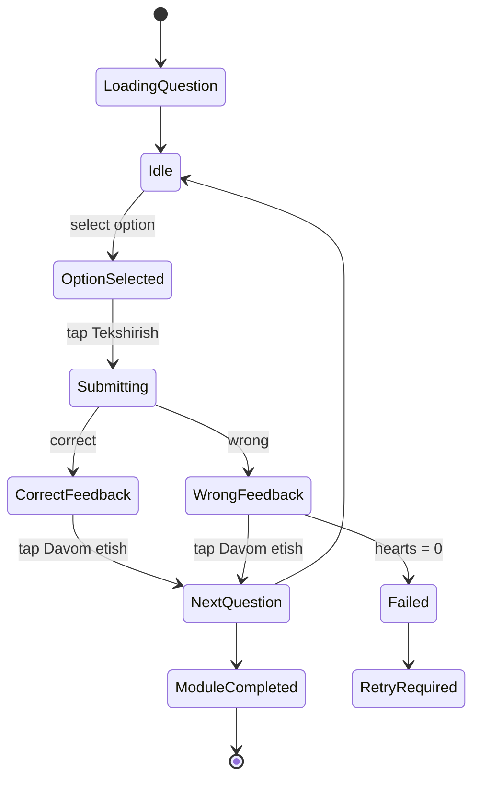

# BURRO FONETIKA
# 12-FIGMA_FLOW_DESIGN.md

## 1. Purpose

This document turns the uploaded Figma mobile screens into an implementation-ready design system and screen-flow specification for the Student App.

Source reference:

- [Figma reference screens](design/reference-screens/README.md)
- [Student implementation flow](13-STUDENT_FLOW_IMPLEMENTATION.md)
- [Design tokens CSS](design/design-tokens.css)
- [Tailwind tokens](../packages/ui/src/tailwind-preset.ts)

## 2. Design Source of Truth

For the Student App, the uploaded Figma screenshots are the visual source of truth.

Important UI flow amendment:

- Figma uses **select answer → Tekshirish → feedback → Davom etish**.
- Student answer must not be permanently evaluated until the user taps **Tekshirish**.
- Backend submit endpoint must be idempotent so double taps do not duplicate answers or XP.

This updates the older auto-submit idea for the Student App UI.

## 3. Target Device

Primary canvas:

```txt
402px × 874px
```

Target:

- Telegram Mini App
- iOS Safari / Android Chrome mobile web
- Safe-area aware full-screen mobile layout

Desktop is not a priority for Student App.

## 4. Visual Identity

### Mood

- Night blue Islamic learning environment
- Soft glass cards
- Child-friendly rounded controls
- Bright cyan primary action
- Green success
- Red error
- Yellow XP / premium highlight

### Background

All main student screens use the same dark illustrated background.

Implementation:

```tsx
<AppBackground variant="student">
  {children}
</AppBackground>
```

Rules:

- Background is fixed to viewport.
- Content scrolls above it.
- Dark blue overlay must keep text readable.
- Never place raw text directly on noisy background without card/overlay.

## 5. Color Tokens

Use tokens from [design-tokens.css](design/design-tokens.css).

| Token | Usage |
|---|---|
| `--burro-bg-950` | main app background |
| `--burro-bg-900` | secondary dark background |
| `--burro-card` | white cards |
| `--burro-text-primary` | text on white cards |
| `--burro-text-on-dark` | text on dark background |
| `--burro-cyan-500` | primary buttons, active nav, audio/mic |
| `--burro-green-500` | correct, completed, success |
| `--burro-red-500` | wrong, danger, logout |
| `--burro-yellow-500` | XP, premium, rank highlight |

## 6. Typography

Recommended font stack:

```css
font-family: Inter, Manrope, system-ui, -apple-system, BlinkMacSystemFont, "Segoe UI", sans-serif;
```

Arabic glyph rendering:

```css
font-family: "Noto Naskh Arabic", "Amiri", serif;
```

Scale:

| Name | Size | Weight | Usage |
|---|---:|---:|---|
| Display | 32 | 800 | rare hero titles |
| H1 | 26 | 800 | screen titles |
| H2 | 22 | 800 | card titles |
| H3 | 18 | 800 | module titles |
| Body | 16 | 500 | normal text |
| Caption | 12 | 500 | meta text |
| Arabic Letter | 88-120 | 700 | exercise cards |

## 7. Layout Rules

Global student layout:

```txt
screen
├── safe-area top
├── content with 20px x-padding
├── flexible scroll area
└── bottom nav / fixed CTA with safe-area bottom
```

Spacing:

| Usage | Value |
|---|---:|
| Screen horizontal padding | 20px |
| Card padding | 20px |
| Card gap | 10-14px |
| Section gap | 20-24px |
| Bottom nav reserved area | 112px |

Radius:

- cards: 24-30px
- buttons: 16-24px
- pills: 999px

## 8. Core Components

### 8.1 AppBackground

Used on all Student screens.

Props:

```ts
type AppBackgroundProps = {
  children: React.ReactNode;
  overlay?: 'default' | 'heavy' | 'light';
  scroll?: boolean;
};
```

### 8.2 GlassCard

White card with soft bottom shadow.

Props:

```ts
type GlassCardProps = {
  children: React.ReactNode;
  className?: string;
  radius?: 'md' | 'lg' | 'xl';
};
```

### 8.3 PrimaryGlowButton

Visual reference:

- Welcome button
- Exercise Tekshirish button
- Completion next module button

States:

| State | Visual |
|---|---|
| default | cyan gradient + glow |
| disabled | same gradient but opacity 55%, no click |
| success | green gradient |
| danger | red gradient |
| loading | spinner + disabled |

### 8.4 BottomNav

Figma items:

```txt
Asosiy
Modullar
O‘rganish
Reyting
Profil
```

Rules:

- fixed bottom
- centered raised learning button
- active icon/text bright
- inactive icons low opacity
- safe-area bottom included

Routes:

| Item | Route |
|---|---|
| Asosiy | `/` |
| Modullar | `/modules` |
| O‘rganish | `/learn/current` |
| Reyting | `/leaderboard` |
| Profil | `/profile` |

### 8.5 LanguagePill

Small rounded language switcher in top-right/profile/header.

Supported:

- Uzbek
- Russian
- English

The screenshot shows Arabic as a UI choice, but product MVP languages remain Uzbek/Russian/English. Arabic can remain hidden behind future feature flag.

### 8.6 ModuleCard

Used on home dashboard and modules grid.

Fields:

- title
- description
- duration
- status
- premium lock
- completion icon

States:

- completed
- available
- locked
- premium_locked
- current

### 8.7 LearningPathNode

Used in path view.

States:

- completed: green check
- current: Arabic letter / highlighted node
- available: white node
- locked: dimmed lock
- premium_locked: yellow lock

Rules:

- vertical path with curved connector line
- current module should be near viewport center
- support 60 modules

### 8.8 QuizShell

Shared shell for all exercises.

Visual elements:

```txt
Top rounded white bar
├── Close X
├── Progress bar
├── Hearts
└── +XP preview

Question card
Options grid
Info button
Bottom CTA
```

Props:

```ts
type QuizShellProps = {
  progressPercent: number;
  hearts?: number;
  xpPreview?: number;
  children: React.ReactNode;
  footer: React.ReactNode;
};
```

### 8.9 ChoiceButton

States:

| State | Visual |
|---|---|
| idle | white card, dark text |
| selected | cyan border + cyan text |
| correct | green fill + white text |
| wrong | red fill + white text |
| disabled | no hover/click |

### 8.10 AudioCircleButton

States:

- idle: white circle, cyan icon
- playing: cyan circle, larger soft cyan outer ring
- disabled: muted

### 8.11 MicCircleButton

Post-MVP feature flag.

States:

- idle
- recording
- processing
- success
- failed

### 8.12 FeedbackCard

Used after answer/module success.

Types:

- correct
- wrong
- module_completed

## 9. Screen Specifications

## 9.1 Welcome Screen

Reference:

- [02-welcome.png](design/reference-screens/02-welcome.png)

Route:

```txt
/welcome
```

Components:

```txt
AppBackground
LogoMark
Title
Subtitle
PrimaryGlowButton
```

Copy:

```txt
Burro
Arab tilini noldan boshlab, oson va qiziqarli o'rganing.
Boshlash
```

CTA behavior:

- Telegram Mini App: call Telegram initData login.
- Browser web: route to `/login?redirect=/`.

## 9.2 Login Screen

Reference:

- [03-login.png](design/reference-screens/03-login.png)

Route:

```txt
/login?redirect=/
```

Important product rule:

- Production auth uses Telegram OTP, not username/password.
- The screenshot is a visual shell reference only.

Production fields:

```txt
Telegram ID / phone hint / bot OTP code
OTP code
Remember this device
Kirish
```

Validation:

- OTP TTL: 2 minutes
- Max retry: 5
- Only internal redirect paths are allowed

## 9.3 Home Dashboard

Reference:

- [04-home-dashboard.png](design/reference-screens/04-home-dashboard.png)

Route:

```txt
/
```

Sections:

1. Profile header
2. Last activity card
3. Daily task card
4. Today result
5. Modules carousel
6. Bottom navigation

Data source:

```txt
GET /student/dashboard
```

Header data:

- avatar
- display name
- active days count
- language

Last activity card:

- module title
- current progress
- question count progress
- estimated time
- continue button

Daily task:

- task title
- reward XP

Today result:

- learning minutes
- XP

## 9.4 Modules Grid

Reference:

- [19-modules-grid.png](design/reference-screens/19-modules-grid.png)

Route:

```txt
/modules?view=grid
```

Rules:

- 2-column grid
- Each card shows module title, short description, duration/status
- Floating view toggle bottom-right

## 9.5 Modules Path

Reference:

- [20-modules-path.png](design/reference-screens/20-modules-path.png)

Route:

```txt
/modules?view=path
```

Rules:

- Duolingo-like vertical path
- Connected nodes
- Completed nodes show green check
- Current node shows Arabic letter or module symbol
- Locked nodes below current module are dimmed/locked

## 9.6 Exercise: Letter to Sound

References:

- [05-exercise-letter-default.png](design/reference-screens/05-exercise-letter-default.png)
- [06-exercise-letter-selected.png](design/reference-screens/06-exercise-letter-selected.png)
- [07-exercise-letter-correct.png](design/reference-screens/07-exercise-letter-correct.png)
- [08-exercise-letter-wrong.png](design/reference-screens/08-exercise-letter-wrong.png)

Route:

```txt
/learn/:moduleId/attempt/:attemptId/question/:questionNo
```

Flow:

```txt
question_loaded
→ option_selected
→ submit_pressed
→ feedback_correct | feedback_wrong
→ continue_pressed
→ next_question | completion
```

CTA labels:

| State | CTA |
|---|---|
| no option selected | Tekshirish disabled |
| option selected | Tekshirish enabled |
| correct/wrong feedback | Davom etish |

Data behavior:

- `Tekshirish` calls answer submit endpoint.
- Submit endpoint must return correct/wrong, correct option, hearts, XP delta.
- UI must lock options after submit.

## 9.7 Exercise: Listen and Choose

References:

- [09-exercise-listen-default.png](design/reference-screens/09-exercise-listen-default.png)
- [10-exercise-listen-playing.png](design/reference-screens/10-exercise-listen-playing.png)

Exercise type mapping:

```txt
listen_find_letter
listen_find_sound
```

Rules:

- Audio button centered in question card.
- Playing state shows cyan fill and soft outer ring.
- Audio can be replayed.
- Submit is not allowed until one option is selected.

## 9.8 Pronunciation Screen

References:

- [11-pronunciation-default.png](design/reference-screens/11-pronunciation-default.png)
- [12-pronunciation-recording.png](design/reference-screens/12-pronunciation-recording.png)

Product status:

```txt
Post-MVP / feature flag
```

Reason:

MVP exercise types are limited to:

- find_letter
- find_sound
- listen_find_letter
- listen_find_sound

Implementation rule:

- Keep design spec ready.
- Do not expose route in MVP unless `FEATURE_PRONUNCIATION=true`.

## 9.9 Sound Info Screen

References:

- [13-sound-info-default.png](design/reference-screens/13-sound-info-default.png)
- [14-sound-info-playing.png](design/reference-screens/14-sound-info-playing.png)

Purpose:

- Short explanation before or inside module practice.
- Audio playback for sound.

Route:

```txt
/learn/:moduleId/sounds/:soundId/info
```

MVP content language:

- Uzbek only for learning explanation.

## 9.10 Full Correct Feedback

Reference:

- [15-feedback-correct.png](design/reference-screens/15-feedback-correct.png)

Use when:

- answer correct
- milestone achieved
- short celebration screen required

No confetti in MVP.

## 9.11 Module Completion

Reference:

- [16-module-completed.png](design/reference-screens/16-module-completed.png)

Route:

```txt
/modules/:moduleId/completed
```

Displays:

- success icon
- Modul Yakunlandi
- motivational text
- XP earned
- accuracy
- Keyingi modul CTA
- Bosh sahifa secondary action

## 9.12 Statistics Screen

Reference:

- [17-statistics.png](design/reference-screens/17-statistics.png)

Route:

```txt
/stats
```

Sections:

- last 7 days XP chart
- accuracy card
- active days card
- review recommendation list

Data source:

```txt
GET /student/stats/summary
```

## 9.13 Profile + Language Bottom Sheet

Reference:

- [18-profile-language-sheet.png](design/reference-screens/18-profile-language-sheet.png)

Route:

```txt
/profile
```

Features:

- avatar
- display name
- student role
- total XP
- active days count
- statistics link
- language selector
- reminder toggle
- logout

Bottom sheet rules:

- overlay darkens current screen
- white sheet appears from bottom
- close button top-right
- language rows use icon + label

MVP languages:

- O‘zbekcha
- Русский
- English

Arabic row is future-only unless explicitly enabled.

## 9.14 Leaderboard

Reference:

- [01-leaderboard.png](design/reference-screens/01-leaderboard.png)

Route:

```txt
/leaderboard
```

Components:

- Top 3 podium
- Rank list cards
- Pinned current student rank card
- Bottom navigation

Identity rules:

Leaderboard shows only:

- Telegram first name
- Telegram avatar
- Telegram username if available
- rank
- class/group label if configured
- XP/score

Never show:

- full name
- age
- parent data
- phone number
- internal admin notes

## 10. Exercise State Machine



## 11. Route Map

| Route | Screen | Reference |
|---|---|---|
| `/welcome` | Welcome | 02 |
| `/login` | Login | 03 |
| `/` | Home dashboard | 04 |
| `/modules?view=grid` | Modules grid | 19 |
| `/modules?view=path` | Modules path | 20 |
| `/learn/current` | Continue learning redirect | 04 |
| `/learn/:moduleId/attempt/:attemptId/question/:questionNo` | Exercise | 05-10 |
| `/learn/:moduleId/sounds/:soundId/info` | Sound info | 13-14 |
| `/modules/:moduleId/completed` | Module completed | 16 |
| `/stats` | Statistics | 17 |
| `/leaderboard` | Leaderboard | 01 |
| `/profile` | Profile/settings | 18 |

## 12. Accessibility Rules

- Minimum touch target: 44px.
- Primary buttons: at least 56px height.
- Do not rely on color only for correct/wrong states; include icon/text feedback.
- Audio and mic buttons must have aria labels.
- Bottom nav active item must expose `aria-current="page"`.

## 13. Implementation Checklist

- [ ] Add background asset and overlay.
- [ ] Add design tokens to Tailwind.
- [ ] Build AppBackground.
- [ ] Build BottomNav.
- [ ] Build PrimaryGlowButton.
- [ ] Build GlassCard.
- [ ] Build QuizShell.
- [ ] Build ChoiceButton states.
- [ ] Build AudioCircleButton states.
- [ ] Build ModuleCard.
- [ ] Build LearningPathNode.
- [ ] Build Leaderboard components.
- [ ] Build Profile language bottom sheet.
- [ ] Use API contracts from [04-API_SPEC.md](04-API_SPEC.md).
- [ ] Use permissions from [05-PERMISSION_MATRIX.md](05-PERMISSION_MATRIX.md).

## 14. Design Risks

| Risk | Fix |
|---|---|
| Background too noisy | add stronger dark overlay |
| Bottom nav overlaps content | reserve bottom padding `calc(112px + env(safe-area-inset-bottom))` |
| Telegram viewport changes | use `100dvh`, not only `100vh` |
| Long Uzbek/Russian text wraps badly | use flexible cards and max 2 line clamp |
| Arabic glyph wrong font | load Arabic font separately |
| XP farming by double submit | backend idempotency key |
| Pronunciation not in MVP | keep behind feature flag |
