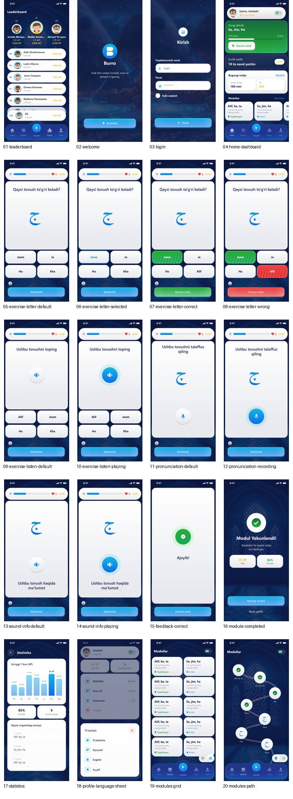

# Figma Reference Screens

These PNG files are copied from the uploaded Figma flow and are used as visual implementation references.

## Contact sheet

## Screens

| # | File | Purpose |
|---|---|---|
| 01 | [01-leaderboard.png](01-leaderboard.png) | Leaderboard podium, list, pinned rank |
| 02 | [02-welcome.png](02-welcome.png) | Welcome / launch screen |
| 03 | [03-login.png](03-login.png) | Web login visual reference |
| 04 | [04-home-dashboard.png](04-home-dashboard.png) | Student home dashboard |
| 05 | [05-exercise-letter-default.png](05-exercise-letter-default.png) | Letter/sound exercise default |
| 06 | [06-exercise-letter-selected.png](06-exercise-letter-selected.png) | Selected answer state |
| 07 | [07-exercise-letter-correct.png](07-exercise-letter-correct.png) | Correct feedback state |
| 08 | [08-exercise-letter-wrong.png](08-exercise-letter-wrong.png) | Wrong feedback state |
| 09 | [09-exercise-listen-default.png](09-exercise-listen-default.png) | Listen exercise default |
| 10 | [10-exercise-listen-playing.png](10-exercise-listen-playing.png) | Listen exercise active audio |
| 11 | [11-pronunciation-default.png](11-pronunciation-default.png) | Pronunciation default, post-MVP feature flag |
| 12 | [12-pronunciation-recording.png](12-pronunciation-recording.png) | Pronunciation recording, post-MVP feature flag |
| 13 | [13-sound-info-default.png](13-sound-info-default.png) | Sound info default |
| 14 | [14-sound-info-playing.png](14-sound-info-playing.png) | Sound info audio playing |
| 15 | [15-feedback-correct.png](15-feedback-correct.png) | Full feedback card |
| 16 | [16-module-completed.png](16-module-completed.png) | Module completion |
| 17 | [17-statistics.png](17-statistics.png) | Statistics and review recommendations |
| 18 | [18-profile-language-sheet.png](18-profile-language-sheet.png) | Profile settings and language bottom sheet |
| 19 | [19-modules-grid.png](19-modules-grid.png) | Modules grid view |
| 20 | [20-modules-path.png](20-modules-path.png) | Modules path view |
| 21 | [21-add-edit-child.png](21-add-edit-child.png) | Add/edit child form with gender selection |

## Notes

- Screen 21 source: `images/students/iPhone 16 & 17 Pro - 29.png`
- Figma raster assets extracted to: `docs/design/figma-assets/` (canvas renders + Arabic text assets)

- Canvas size: 402 × 874 px.
- Design target: Telegram Mini App first, then mobile web.
- Bottom navigation and safe-area padding are mandatory.
